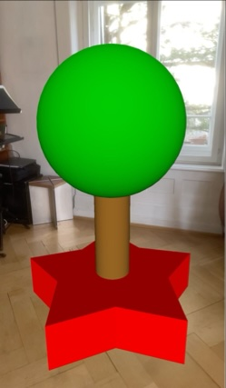

# Ahead Staging


Ahead staging is a technique for presenting 3D content in a way that it is aligned to the spectator’s position and view direction. After the initial staging, users can interact with the virtual scene from their current position or move toward and around the staged content.

* _Use Case_: Spatial Presentation
* _Technology Platform_: [ARchi VR](../README.md)

## Instant Ahead Staging


### AR Patterns

__Behavior Pattern__
* _Event_: on floor detection
* [Instant Reaction](https://github.com/ARpatterns/catalog/blob/main/behavioral-patterns/instant-reaction.md): Immediate execution of the staging ahead action

__Augmentation Pattern__
* [Ahead Staging](https://github.com/ARpatterns/catalog/blob/main/augmentation-patterns/ahead-staging.md): presenting 3D object `red.box`1.5 m  in front of the user.
  * _Placed_: initial ahead of the user on the floor.
  * _Aligned_: initial towards the user in view direction.

### Diagram

 | on:command |  &rarr; | do:add ahead 0 0 -1.2 |
 |---|---|---|
> 'red.box' ➕

### Code

```json
{
  "$schema": "https://service.metason.net/ar/schemas/action.json",
  "items" : [
    {
      "type" : "Geometry",
      "subtype" : "Cube",
      "id" : "red.box",
      "attributes" : "color:#FF0000; wxdxh:0.55x0.55x0.55; ratio:0.2"
    }
  ],
  "tasks" : [
    {
      "do" : "add",
      "id" : "red.box",
      "ahead" : "0 0 -1.2"
    }
  ]
}
```

### Links

* _Detailed Docu_: [docs/instantStaging.md](docs/instantStaging.md)
* _Source Code_: [actions/instantStaging.json](actions/instantStaging.json)

## Multiple Ahead Staging



### AR Patterns

__Behavior Pattern__
* _Event_: on floor detection
* [Instant Reaction](https://github.com/ARpatterns/catalog/blob/main/behavioral-patterns/instant-reaction.md): Immediate execution of a list of staging ahead actions.

__Augmentation Patterns__
* [Ahead Staging](https://github.com/ARpatterns/catalog/blob/main/augmentation-patterns/ahead-staging.md): presenting three 3D objects 1.5 m in front of the user at differnt heights.
  * _Placed_: initial ahead of the user. The first on the floor, the others above it.
  * _Aligned_: initial towards the user in view direction. 

### Diagram

 | on:command |  &rarr; | do:add ahead 0 0 -1.5 |
 |---|---|---|
> 'red.star' ➕
 
 | on:command |  &rarr; | do:add ahead 0 0.24 -1.5 |
 |---|---|---|
> 'brown.cylinder' ➕
 
 | on:command |  &rarr; | do:add ahead 0 0.72 -1.5 |
 |---|---|---|
> 'green.sphere' ➕

### Code

```json
{
  "$schema": "https://service.metason.net/ar/schemas/action.json",
  "items" : [
    {
      "type" : "Geometry",
      "subtype" : "Star",
      "id" : "red.star",
      "attributes" : "color:#FF0000; wxdxh:1.1x1.1x0.25; rays:5; ratio: 0.6",
      "isLocked" : true
    },
    {
      "type" : "Geometry",
      "subtype" : "Cylinder",
      "id" : "brown.cylinder",
      "attributes" : "color:#996622; wxdxh:0.2x0.2x0.5",
      "isLocked" : true
    },
    {
      "type" : "Geometry"
      "subtype" : "Sphere",
      "id" : "green.sphere",
      "attributes" : "color:#00CC00; wxdxh:0.75x0.75x0.75",
      "isLocked" : true
    }
  ],
  "tasks" : [
    {
      "do" : "add",
      "id" : "red.star",
      "ahead" : "0 0 -1.5"
    },
    {
      "do" : "add",
      "id" : "brown.cylinder",
      "ahead" : "0 0.24 -1.5"
    },
    {
      "do" : "add",
      "id" : "green.sphere",
      "ahead" : "0 0.72 -1.5"
    }
  ]
}
```

### Links

* _Detailed Docu_: [docs/multipleStaging.md](docs/multipleStaging.md)
* _Source Code_: [actions/multipleStaging.json](actions/multipleStaging.json)

## Indirect Ahead Staging


### AR Patterns

__Behavior Pattern__
* _Event_: on tapping
* [Conditional Reaction](https://github.com/ARpatterns/catalog/blob/main/behavioral-patterns/conditional-reaction.md): Pressing the overlay button (+) in the bottom right corner sets a data flag. If the data flag becomes the value of 1 the ECA rule is executing the ahead staging action that places the 3D object into the scene.

__Augmentation Pattern__
* [Ahead Staging](https://github.com/ARpatterns/catalog/blob/main/augmentation-patterns/ahead-staging.md): placing virtual 3D object `wooden.chest` 1.5 m in front of the user on the floor.
  * _Placed_: initial ahead of the user on the floor.
  * _Aligned_: initial towards the user in view direction.

### Diagram

 | on:command |  &rarr; | do:add |
 |---|---|---|
> 'overlay.button' ➕
 
 | as:stated | if:`data.flag == 1`| do:add ahead 0 0 -1.5 |
 |---|---|---|
> 'wooden.chest' ➕
 
### Code

```json
{
  "$schema": "https://service.metason.net/ar/schemas/action.json",
  "items" : [
    {
      "type" : "3D Object",
      "subtype" : "Interior",
      "id" : "wooden.chest",
      "asset" : "https://service.metason.net/ar/content/assets/3D/chest.usdz",
      "attributes" : "wxdxh:0.77x0.58x0.56;"
    },
    {
      "type" : "Overlay",
      "subtype" : "Image",
      "id" : "overlay.button",
      "asset" : "https://service.metason.net/ar/extension/images/plus.png",
      "attributes" : "right:20;bottom:20;width:40;height:40;",
      "content" : "on:tap= assign('data.flag', 1)"
    }
  ],
  "tasks" : [
    {
      "do" : "add",
      "id" : "overlay.button"
    },
    {
      "as" : "stated",
      "if" : "data.flag == 1",
      "do" : "add",
      "id" : "wooden.chest",
      "ahead" : "0 0 -1.5"
    }
  ]
}
```

### Links

* _Detailed Docu_: [docs/indirectStaging.md](docs/indirectStaging.md)
* _Source Code_: [actions/indirectStaging.json](actions/indirectStaging.json)

## References

> [!TIP]
> Try out the examples: Open `aheadStaging.arproject` in [ARchi Composer](https://service.metason.net/ar/docu/#archi-composer) for browsing, editing, and live-injecting the code from your Mac to the [ARchi VR App](https://archi.metason.net) on your iOS device.

- ARchi VR [Technical Documentation](https://service.metason.net/ar/docu/)
- ARchi VR [App](https://archi.metason.net)
- AR Pattern [Diagram](https://github.com/ARpatterns/diagram)
