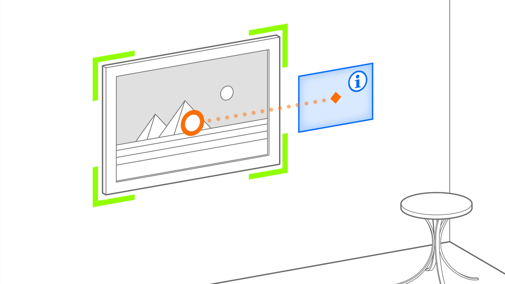

# Anchored Supplement



Provide additional information that is aligned with a detected entity.

* _Use Case_: Anchored Complement
* _Technology Platform_: [ARchi VR](../README.md)
* _Device Type_: handheld 
* _Vision System_: world camera 
  


## AR Patterns

__Behavior Patterns__
* [Instant Reaction](https://github.com/ARpatterns/catalog/blob/main/behavioral-patterns/instant-reaction.md): Immediate execution of the superimposition action
  * _Event_: on [image](images/JazzIsBack.jpg) detection
* [Conditional Reaction](https://github.com/ARpatterns/catalog/blob/main/behavioral-patterns/conditional-reaction.md): remove superimposed object when no longer visible.

__Augmentation Pattern__
* [Anchored Supplement](https://github.com/ARpatterns/catalog/blob/main/augmentation-patterns/anchored-supplement.md): Presentation of 3D content aligned to detected entity for enhancement.
  * _Placed_: on detected image.
  * _Aligned_: with detected image.

## Diagram

 | on:start |  &rarr; | do:detect:image |
 |---|---|---|
 
> Install image detector 0.29x0.40 &larr; _on:response_  •••  $SERVER/images/JazzIsBack.jpg 👁
> | _on:detect_ | &rarr; | _do:add to AR anchor_ |
> |---|---|---|
> 
>> 'detected.image.flipped' ➕
> 
> | _as:stated_ | _if:`visible('detected.image.flipped') == false`_ | _do:remove_ |
> |---|---|---|
> 
>> 'detected.image.flipped' ❌


## Code

```json
{
  "$schema": "https://service.metason.net/ar/schemas/action.json",
  "items" : [
    {
      "asset" : "Poster by the<br>music club <b>Moods</b> <br> <small><br>Zürich (2021)<br></small>",
      "attributes" : "color:#000000; bgcolor:#FFBB33CC; scale:0.75;x:-0.5;y:0.0;",
      "id" : "info.panel",
      "isLocked" : true,
      "name" : "Panel",
      "subtype" : "Panel",
      "type" : "Spot"
    },
    {
      "attributes" : "color:#FFBB33CC;width:0.013;",
      "id" : "info.line",
      "isLocked" : false,
      "name" : "Polylink",
      "subtype" : "Polylink",
      "type" : "Route",
      "vertices" : [
        [
          -0.275,
          0.2,
          0
        ],
        [
          -0.1,
          0.2,
          0
        ],
        [
          0.0,
          0.1,
          0
        ],
        [
          0,
          0.0,
          0
        ]
      ]
    },
    {
      "attributes" : "wxdxh:0.29x0.0x0.4;",
      "children" : "info.panel, info.line",
      "id" : "detected.image.enhanced",
      "isLocked" : false,
      "name" : "Detected Image",
      "subtype" : "Group",
      "type" : "Geometry",
      "vertices" : [
        [
          0,
          0,
          0
        ],
        [
          0,
          0,
          1
        ]
      ]
    }
  ],
  "tasks" : [
    {
      "dispatch" : "atstart",
      "do" : "skip",
      "state" : "floor"
    },
    {
      "do" : "detect",
      "id" : "detected.image.enhanced",
      "height" : "0.40",
      "img" : "$SERVER/images/JazzIsBack.jpg",
      "up" : "global",
      "width" : "0.29"
    }
  ]
}
```

## Links

* _Detailed Docu_: [docs/supplement.md](docs/supplement.md)
* _Source Code_: [actions/supplement.json](actions/supplement.json)
* _Assets_: [JazzIsBack.jpg](images/JazzIsBack.jpg)

## References

> [!TIP]
> Try out the examples: Open `supplement.arproject` in [ARchi Composer](https://service.metason.net/ar/docu/#archi-composer) for browsing, editing, and live-injecting the code from your Mac to the [ARchi VR App](https://archi.metason.net) on your iOS device.

- ARchi VR [Technical Documentation](https://service.metason.net/ar/docu/)
- ARchi VR [App](https://archi.metason.net)
- AR Pattern [Diagram](https://github.com/ARpatterns/diagram)