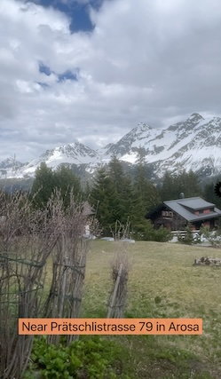
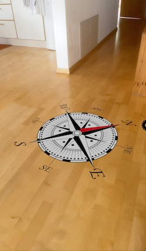
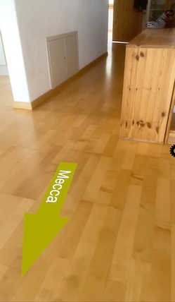

# Geolocated Remark

A geolocated remark is based on location data (latitude and longitude) from the Global Positioning System (GPS) or by georeferenced address data (i.e., country, city, street, building name).

## Geolocated Information



Presentation of location info as overlay. 

### AR Patterns

_Behavior_
* [Instant Reaction](https://github.com/ARpatterns/catalog/blob/main/behavioral-patterns/instant-reaction.md): Immediate execution of the geolocated remark action

_Augmentation_
* [Geolocated Remark](https://github.com/ARpatterns/catalog/blob/main/augmentation-patterns/geolocated-remark.md): presenting location info as overlay.
  * Placed: on screen as overlay.

### Diagram

 | on:command |  &rarr; | do:skip |
 |---|---|---|
> floor detection ⏭
 
 | on:command |  &rarr; | do:add |
 |---|---|---|
> 'overlay.label' ➕
 
 | on:command |  &rarr; | do:setText |
 |---|---|---|
> 'overlay.label': text = join({'Near', location.place, 'in', location.city}, ' ')


### Code

```json
{
  "$schema": "https://service.metason.net/ar/schemas/action.json",
  "items" : [
    {
      "type" : "Overlay",
      "subtype" : "Label",
      "id" : "overlay.label",
      "attributes" : "color:#000000;bgcolor:#FF9966DD;cx:0;bottom:80;width:130;height:28;",
      "name" : "Your Location?"
    }
  ],
  "tasks" : [
    {
      "do" : "skip",
      "state" : "floor"
    },
    {
      "do" : "add",
      "id" : "overlay.label"
    },
    {
      "do" : "setText",
      "id" : "overlay.label",
      "expression" : "join({'Near', location.place, 'in', location.city}, ' ')"
    }
  ]
}
```

### Runtime Context

The `do:setValue` expression is accessing variables from the runtime context of the current AR session. A full context is stored as a snapshot in [context.json](context.json). The location data as excerpt:

```json
  ...
  "location" : {
    "postalCode" : "7050",
    "place" : "Prätschlistrasse 79",
    "longitude" : 9.673938928181002,
    "country" : "Schweiz",
    "latitude" : 46.789472037970206,
    "level" : 0,
    "address" : "Prätschlistrasse 79",
    "countryCode" : "CH",
    "altitude" : 1904.1698532719165,
    "environment" : "outdoor",
    "city" : "Arosa",
    "state" : "GR"
  },
  ...
```

The join function in the expression is gathering the values of `location.place` and `location.city` from the runtime context to form the text for the overlay. 

### Links

* Detailed Docu: [docs/geoLoc.md](docs/geoLoc.md)
* Source Code: [actions/geoLoc.json](actions/geoLoc.json)

## Cardinal Direction to North



Presentation of an oriented compass windrose on the floor. 

### AR Patterns

_Behavior_
* [Instant Reaction](https://github.com/ARpatterns/catalog/blob/main/behavioral-patterns/instant-reaction.md): Immediate execution of the staging ahead action.

_Augmentation_
* [Ahead Staging](https://github.com/ARpatterns/catalog/blob/main/augmentation-patterns/ahead-staging.md): presenting windrose image 1 m in front of the user.
  * Placed: initial ahead of the user on the floor.
  * Aligned: towards the north direction of compass sensor. 

### Diagram

 | on:command |  &rarr; | do:clear |
 |---|---|---|
> 'UI'
 
 | on:command |  &rarr; | do:add ahead 0.0 0.0 -1.0 |
 |---|---|---|
> 'net.metason.archi.windrose' ➕
 
 | on:command |  &rarr; | do:turn to 0.0 |
 |---|---|---|
> 'net.metason.archi.windrose'

### Code

```json
{
  "$schema": "https://service.metason.net/ar/schemas/action.json",
  "items" : [
    {
      "asset" : "https://service.metason.net/ar/content/north/windrose.png",
      "attributes" : "wxdxh:1.0x1.0x0.0;",
      "id" : "net.metason.archi.windrose",
      "name" : "Wind Rose",
      "subtype" : "Panel",
      "type" : "Spot"
    }
  ],
  "tasks" : [
    {
      "do" : "clear",
      "id": "UI"
    },
    {
      "do" : "add",
      "id" : "net.metason.archi.windrose",
      "ahead" : "0.0 0.0 -1.0"
    },
    {
      "do" : "turn",
      "id" : "net.metason.archi.windrose",
      "to" : "0.0"
    }
  ]
}
```

Because the z-axis of the AR scene is oriented towards south, the flat image is oriented towards north when the turn angle isset to 0.

### Links

* Detailed Docu: [docs/compass.md](docs/compass.md)
* Source Code: [actions/compass.json](actions/compass.json)


## Navigational Direction



Presentation of a direction arrow towards Mecca.

### AR Patterns

_Behavior_
* [Instant Reaction](https://github.com/ARpatterns/catalog/blob/main/behavioral-patterns/instant-reaction.md): Immediate execution of the request to the server for getting the direction to mecca.
* [Request-Response](https://github.com/ARpatterns/catalog/blob/main/behavioral-patterns/request-response.md): Remote call resulting in asynchronously receiving ECA rules from the server.

_Augmentation_
* [Ahead Staging](https://github.com/ARpatterns/catalog/blob/main/augmentation-patterns/ahead-staging.md): placing virtual 3D object `wooden.chest` 1.5 m in front of the user on the floor.
  * Placed: Placed: initial ahead of the user on the floor.
  * Aligned: initial towards the user in view direction.

### Diagram

 | on:command |  &rarr; | do:clear |
 |---|---|---|
> 'UI'
 
 | on:command |  &rarr;  | do:request POST:USER |
 |---|---|---|
> &darr; _do:run_ &larr; _on:response_ ••• https://service.metason.net/arext/mecca/ 
 
### Code

```json
{
  "$schema": "https://service.metason.net/ar/schemas/action.json",
  "items": [
  ],
  "tasks": [
    {
      "do" : "clear",
      "id": "UI"
    },
    {
      "do" : "request",
      "url": "https://service.metason.net/arext/mecca/",
      "upload": "POST:USER"
    }
  ]
}
```

### Request-Response

The REST API call will post user data including lattitude/longitude to the server. The server is calculating the orientation towards Mecca as an orientation _angle-value_ and returns the result as JSON data.

```json
{
  "$schema": "https://service.metason.net/ar/schemas/action.json",
  "items": [
    {
      "id": "net.metason.archi.mecca",
      "type" : "Route",
      "subtype" : "Direction",
      "attributes" : "color:#F0E800;flat:1;",
      "vertices" : [
        [
          0.0,
          0.0,
          0.0
        ],
        [
          0.0,
          0.0,
          0.7
        ]
      ],
      "name" : "Mecca"
    }   
  ],
  "tasks": [
    {
      "do" : "add",
      "id": "net.metason.archi.mecca",
      "ahead" : "0.0 0.0 -0.75"
    },
    {
      "do" : "turn",
      "id" : "net.metason.archi.mecca",
      "to" : "angle-value"
    }
  ]
}
```

A sample server using Flask/Python is available at  
[https://github.com/metason/ARchiWebService](https://github.com/metason/ARchiWebService) which demonstrates the corresponding Web Service for  this example.

### Links

* Detailed Docu: [docs/navigation.md](docs/navigation.md)
* Source Code: [actions/navigation.json](actions/navigation.json)


## References

> [!TIP]
> Try out the examples: Open `geolocRemark.arproject` in [ARchi Composer](https://service.metason.net/ar/docu/#archi-composer) for browsing, editing, and live-injecting the code from your Mac to the [ARchi VR App](https://archi.metason.net) on your iOS device.

- ARchi VR [Technical Documentation](https://service.metason.net/ar/docu/)
- ARchi VR [App](https://archi.metason.net)
- AR Pattern [Diagram](https://github.com/ARpatterns/diagram)
