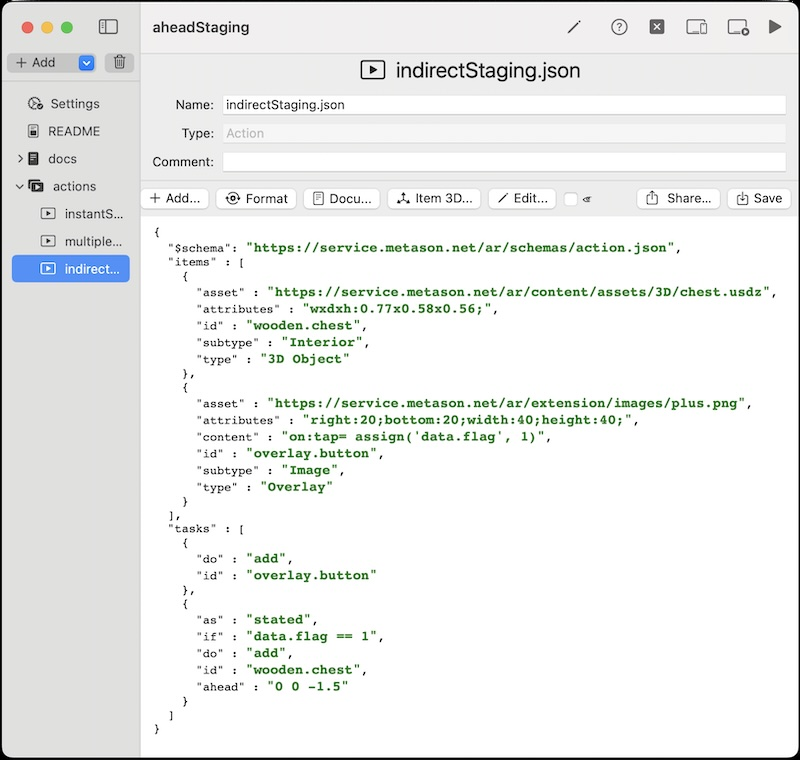
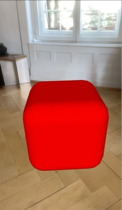
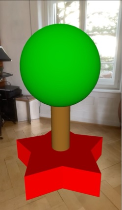
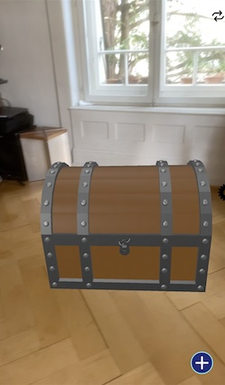
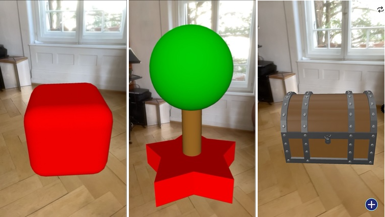
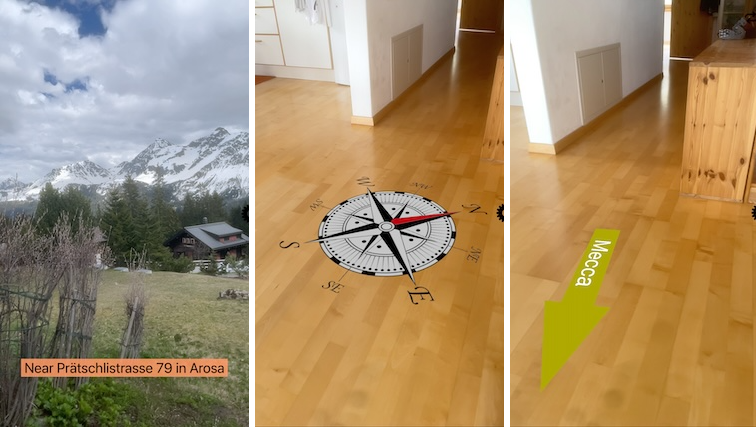
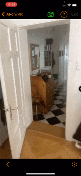
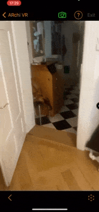

# AR Patterns in DeclARe using ARchi VR App

## DeclARe - Declarative Creation of AR Content 

DeclARe is a scripting language for the creation of AR experiences. Instead of using a programming language to algorithmically define how AR content should be created and behave, it is based on a declarative approach that focuses on specifying WHAT needs to be accomplished with WHICH asset. To achieve this, the ARchi VR app interprets declarations in JSON data structures that do not include conventional programming code, but instead use active Event-Condition-Action rules to define the behavior of the AR experience. See the [Technical Documentation](https://service.metason.net/ar/docu/) on how to create curated AR content using DeclARe.

### ARchi VR App
The mobile [ARchi VR App](https://archi.metason.net) is avialbable for iOS devices and interprets 'DeclARe' scripts as hand-held AR experiences. You may download ARchi VR for free on the [Apple App Store](https://itunes.apple.com/ch/app/archi-vr/id1317896781?mt=8).

### ARchi Composer

ARchi Composer is a low-code editor for Mac to create dynamic and interactive AR content using the "DeclARe" scripting approach.
The following scenarios of applied AR Patterns listed below are all provided as ARchi Composer projects. The sample scripts can be edited and live-injected to the ARchi VR App. The [ARchi Composer](https://service.metason.net/ar/docu/#archi-composer) is provided as free low-code editor. 

---

## Scenarios of applied AR Patterns

### Ahead Staging

<!--  -->

Presentation of 3D content ahead of user.

* _Behavioral Patterns_: Instant Reaction, Indirect Reaction
* _Augmentation Patterns_: Ahead Staging
* _Project Link_: [Ahead Staging](AheadStaging)

### Geolocated Remark

### Anchored Supplement

Presentation of 3D content aligned to detected entity for enhancement.

* _Behavioral Patterns_: Instant Reaction, Indirect Reaction
* _Augmentation Patterns_: Captured Twin, Anchored Supplement
* _Project Link_: [AnchoredSupplement](AnchoredSupplement)

### Superimposition

Presentation of 3D content covering and replacing a detected entity.

* _Behavioral Patterns_: Instant Reaction, Indirect Reaction
* _Augmentation Patterns_: Captured Twin, Superimposition
* _Project Link_: [Superimposition](Superimposition)

### Staged Linear Progression

Sequence of ordered presentations in spatial context using foward/backward buttons.

* _Behavioral Patterns_: Instant Reaction
* _Augmentation Patterns_: Staged Progression
* _Project Link_: [Staged Progression](StagedProgression)

start, step1, step2, end

### Staged Temporal Progression

Sequence of temporal presentations in spatial context.

* _Behavioral Patterns_: Timed Reaction
* _Augmentation Patterns_: Staged Progression
* _Project Link_: [Temporal Progression](TemporalProgression)

scene1, scene2 

<!-- 

### Geolocated Remark
Overlay: "You are near XXX in TOWN"
Overlay: "and you are indoor/outdoor"

Cardinal direction to North
Navigation towards Mecca

### Interactive Non-linear Progression?
Dialog
start step1, step2A, step2B, step3

-->