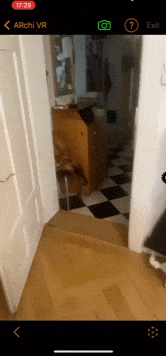

# Superimposition


Superimposition aims to cover a detected entity with a virtual object so that the real object is no longer visible.

* _Use Case_: Spatial Presentation
* _Technology Platform_: [ARchi VR](../README.md)
* _Device Type_: handheld 
* _Vision System_: world camera 




## AR Patterns

__Behavior Patterns__
* [Instant Reaction](https://github.com/ARpatterns/catalog/blob/main/behavioral-patterns/instant-reaction.md): Immediate execution of the superimposition action
  * _Event_: on [image](images/JazzIsBack.jpg) detection
* [Conditional Reaction](https://github.com/ARpatterns/catalog/blob/main/behavioral-patterns/conditional-reaction.md): remove superimposed object when nolonger visible.

__Augmentation Pattern__
* [Superimposition](https://github.com/ARpatterns/catalog/blob/main/augmentation-patterns/superimposition.md): presentation of 3D content replacing the detected image.
  * _Placed_: on detected image.
  * _Aligned_: with detected image.

## Diagram

 | on:call |  → | do:detect:image |
 |---|---|---|
 
> Install image detector 0.29x0.40 ← _on:response_  •••  $SERVER/images/JazzIsBack.jpg 👁
> | _on:detect_ | → | _do:add to AR anchor_ |
> |---|---|---|
> 
>> 'detected.image.flipped' ➕
> 
> | _as:stated_ | _if:`visible('detected.image.flipped') == false`_ | _do:remove_ |
> |---|---|---|
> 
>> 'detected.image.flipped' ❌


## Code

```json
{
  "$schema": "https://service.metason.net/ar/schemas/action.json",
  "items" : [
    {
      "type" : "Spot",
      "type" : "Spot",
      "id" : "upsidedown.image",
      "asset" : "$SERVER/images/JazzIsDown.jpg",
      "attributes" : "wxdxh:0.29x0.0x0.4;",
      "name" : "Image Panel",
      "type" : "Spot",
      "vertices" : [
        [
          0,
          -0.2,
          0
        ]
      ]
    },
    {
      "type" : "Geometry",
      "subtype" : "Group",
      "id" : "detected.image.flipped",
      "attributes" : "wxdxh:0.29x0.0x0.4;y:-0.2;rx:-90;",
      "children" : "upsidedown.image",
      "name" : "Detected Image",
      "vertices" : [
        [
          0,
          0,
          0
        ],
        [
          0,
          0,
          1
        ]
      ]
    }
  ],
  "tasks" : [
    {
      "dispatch" : "atstart",
      "do" : "skip",
      "state" : "floor"
    },
    {
      "do" : "detect",
      "id" : "detected.image.flipped",
      "height" : "0.40",
      "img" : "$SERVER/images/JazzIsBack.jpg",
      "op" : "say('Jazz is upside down')",
      "width" : "0.29"
    }
  ]
}
```

## Links

* _Detailed Docu_: [docs/flipImage.md](docs/flipImage.md)
* _Source Code_: [actions/flipImage.json](actions/flipImage.json)
* _Assets_: [JazzIsBack.jpg](images/JazzIsBack.jpg), [JazzIsDown.jpg](images/JazzIsDown.jpg)


## References

> [!TIP]
> Try out the examples: Open `superImposition.arproject` in [ARchi Composer](https://service.metason.net/ar/docu/#archi-composer) for browsing, editing, and live-injecting the code from your Mac to the [ARchi VR App](https://archi.metason.net) on your iOS device.

- ARchi VR [Technical Documentation](https://service.metason.net/ar/docu/)
- ARchi VR [App](https://archi.metason.net)
- AR Pattern [Diagram](https://github.com/ARpatterns/diagram)