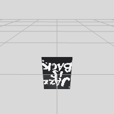

# actions/flipImage.json

## Items 

__1__:  &nbsp; &nbsp; 

__1 'upsidedown.image'__ - Image Panel  🔓
- Spot.Panel
- $SERVER/images/JazzIsDown.jpg
- wxdxh:0.29x0.0x0.4;

__2 'detected.image.flipped'__ - Detected Image  🔓
- Geometry.Group
- wxdxh:0.29x0.0x0.4;y:-0.2;rx:-90;
- children: upsidedown.image

## Tasks 

 | atstart |  &rarr; | do:skip |
 |---|---|---|
> floor detection ⏮
 
 | on:call |  &rarr; | do:detect:image |
 |---|---|---|
 
> Install image detector 0.29x0.40 &larr; _on:response_  •••  $SERVER/images/JazzIsBack.jpg 👁
> | _on:detect_ | &rarr; | _do:execute:op_ |
> |---|---|---|
> 
> > `say('Jazz is upside down')`  
> 
> | _on:detect_ | &rarr; | _do:add to AR anchor_ |
> |---|---|---|
> 
>> 'detected.image.flipped' ➕
> 
> | _as:stated_ | _if:`visible('detected.image.flipped') == false`_ | _do:remove_ |
> |---|---|---|
> 
>> 'detected.image.flipped' ❌
 

## References 

__Code Refs__

- actions/flipImage.json

__Asset Refs__

- _Detector image:_ $SERVER/images/JazzIsBack.jpg
- _Item asset:_ $SERVER/images/JazzIsDown.jpg

__Project Refs__

- _Project Name:_ superImposition
- _Description:_ Superimpose flipped image on detected image 

__Technology Refs__

- _Technical Documentation :_ https://service.metason.net/ar/docu/
- _AR Pattern Diagram :_ https://github.com/ARpatterns/diagram
- _ARchi VR App :_ https://archi.metason.net
